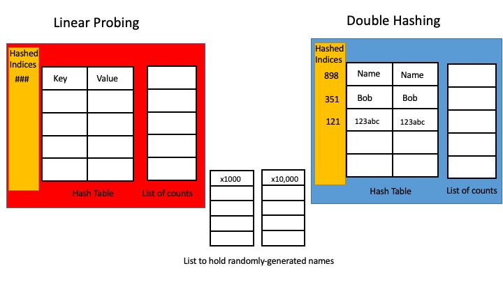
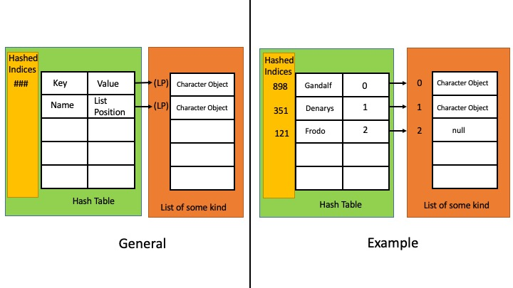

# Project 2: Hashing Project - Probing Experiment/MMORPG Database
**Purpose:** To practice and demonstrate proficiency in creating, manipulating and utilizing hash tables and concepts around hashing.

**Skills Used:** Java programming

**Knowledge Goals:** Hash Tables, Hashing, Linear Probing, Double Hashing

## Overall Summary
For this project, you will be given the opportunity to pick between two projects. The projects are:
* [Linear Probing vs. Double Hashing Experiment](#linear-probing-vs-double-hashing-experiment): you will run an experiment that will examine the performance of linear probing versus double hashing by searching through two lists of randomly generated names and measuring statistics from each search.
* [Massive Multiplayer Online Game Database](#massive-multiplayer-online-game-database): you will implement a database that will store the players in a MMOG by using a list and a hashed dictionary. This will require creating a Player class and indexing them with hash functions. You will be expected to implement searching between quadratic probing, double hashing or separate chaining.

Don't forget to check out the Format Requirements, Assessment and Deliverables which applies to either assignment.

The rest of this assignment page is divided into two parts, one for each project. Please use the links above to skip to which project you are doing.

## Linear Probing vs. Double Hashing Experiment
### Summary
The purpose of this experiment is to compare the average number of probes for an unsuccessful search using linear collision resolution versus double hashing collision resolution. We expect they will be the same but we want to verify that. Additionally, we would like to determine how different their distributions are (by using the standard deviation). This experiment will require the use of two disjoint lists of names. The first one will have 1000 names and the second will have 10,000 names. I strongly encourage you to write methods that will randomly generate these names and put them into List types. Actually creating these files is possible but you must be 100% sure they are disjoint: they do not contain common names (a difficult task when creating them manually).

### Tasks
1. For both collision resolution schemes, calculate the load factor that results in an average of 1.5 comparisons for an unsuccessful search of a hash table holding 100 objects. What is the required size for the hash table? Including the results of this in your comments in Main.
2. Create two hash tables of the size you determined and two empty lists. These will hold the counts. Now use linear probing for one table and double hashing for the other. You will then have a loop that iterate 1000 times. Upon each iteration, it will do the following:
    1. Clear the hash tables.
    2. Randomly choose 100 names from the list of 1000 and insert them into the tables.
    3. Randomly choose 100 names from the list of 10,000 and search the tables for each name. (all searches will be unsuccessful because the two lists are disjoint).
    4. Count the number of comparisons made in each table for the 100 searches and record the count in the list corresponding to the table.

After the iteration is complete, each list should contain 1000 values. Each of these values represents the total number of comparisons required to search for 100 names. Now compute the average and standard deviation of each list. For these metrics, we expect both hash tables to be equal to around 150 with a standard deviation between 8 and 9.

**Now rerun your experiment and change the number of names searched for to 1000.** Has the average and standard deviations changed? If so, why is that true? If not, explain this as well. Experiment with even larger numbers and smaller ones to create your hypothesis.

*There is a massive amount of room for going above and beyond here as you can continue to experiment and evaluate results.*

### Part 1: UML Class Diagram
Create a UML class diagram of the project. Because our projects are not large in scope, these UML diagrams will sometimes be pretty simple. Use any of the UML creators I offered as options on Canvas. Please submit the UML Class Diagram as either PDF or image file such as JPG, PNG, etc. Please use the tutorial given in the Prelude of the book as an example. The UML diagram for this experiment should be pretty simplistic.

### Part 2: Java Implementation

Interfaces and Classes
* DictionaryInterface
    * Interface for the hashed dictionary (should be the same one from class)
* DoubleHashingWithCount
    * Hashed Dictionary Implementation using double hashing
* LinearProbingWithCount
    * Hashed Dictionary Implementation using linear probing
* Main
    * Where you run the experiment.
If you feel that other classes would benefit your project, you are free to add more.

The interface file should be the same as the one used in class.

### Methods for Dictionary Implementations beyond whats in the implementation
Most of these should be in the code implemented in class.
* displayHashTable
* getProbes (returns the number of probes needed for comparisons)
* resetProbeCount
* getHashIndex
* getSecondHashIndex (only for DoubleHashing)
* probe
* locate
* enlargeHashTable
* isHashTableTooFull
* getNextPrime
* isPrime
* checkIntegrity
* checkCapacity
* checkSize
* KeyIterator class
* ValueIterator class
* TableEntry class

### Layout


### Output
Your output for this experiment should indicate clearly the average number of probes for both collision resolution methods as well as the standard deviation for both. Please be clear in what is what in your output so I can understand it.

### Some other items of importance
* Use javadoc comments on your functions to explain what they do. You do not have to do this in the class implementations where there is an interface, you can use @inheritDoc.
* Be sure your code is clean, legible and easy to read.
* Feel free to go above and beyond!  Add new methods and functionality, test in different ways in addition to what you are required to do, be creative! The top grades go to those who go above and beyond. Strive for excellence.
* You are not required to create unit tests but are welcome to do so if you wish.
* Including the runtime as a comment on algorithms with loops in them will be seen as going above and beyond as well.

## Massive Multiplayer Online Game Database
### Summary
The purpose of this project is to create a database model for a massive multiplayer online roleplaying game (MMOG). A MMOG is a game where players sign on and play with other players around the world in a virtual setting. The type of game is of your choice. If you have never played one, feel free to do a little research and look them up online. A few examples are World of Warcraft, League of Legends and The Elder Scrolls Online. 

The important thing is that we want to emulate the records of this MMOG. Each record contains data about a player. So whenever someone joins the game, an account is created and assigned a unique record number. This number is used to locate a player record. Because the game is so popular, this MMOG rarely gets a request to delete an account.

In this scenario, the number of players increased to the thousands and the developers realized they could not keep the entire database in memory so they chose to use an indexing scheme. In this scheme, the player's name and record number would be stored in memory, but their entire player record would only be loaded if they were logged into the game.

You are going to implement this database system using a list and a Hashed Dictionary. The list should store each player as an instance of the character class described below. Each time a new player account is created, it is added to the end of the list so that its position is also its record number. If an account is deleted, its position in the list should be set to null so the positions of the other entries do not change. For the dictionary, you will need to have the entry be a record number (list position) to point to the player's detail in the list. The key will store the character's name. The index is hashed, as usual. You will add two names that will cause collision in which you will have a collision resolution method available to use. You are free to choose what kind of list you want to use in the database: the actual Java List data type, an ADT list, a linked list, an array, an ArrayList, or whatever makes sense for you.

#### Character Class

The data of the class should include the character's name, height, weight, moral alignment and health. You are free to be creative here and add more or alter the suggestions on how I'm measuring them but make sure they make sense. My suggestions are make the moral alignment of a character ranging from -1.0 (evil) to 0.0 (neutral) to 1.0 (virtuous). The health of a character could be a real number between 0.0 (dead) to 1.0 (totally healthy) or a range of any real numbers. Initially, characters are totally healthy and have whatever moral alignment is set for them. In your Main, you should be able to initialize a character's name, heigh, weight and perform the following operations: 

heal: increase a character's health by a user-supplied amount.
injure: decrease a character's health by a user-supplied amount.
The two above could be combined into one.
change: Change a character's moral alignment by a random percentage supplied by a user's parameter. A positive parameter increases it, a negative parameter decreases it.
toString (also could call it printCharacterSheet): returns a string that describes the current values of a character's data fields.

### Tasks
1. Create or use the in-class version of the Hashed Dictionary. Be sure it has its interface as well. Alter your add() in HashedDictionary to put a line that tells us the hash index once its established.
2. Ensure the Hashed Dictionary has a collision resolution schema of your choice: quadratic probing or double hashing. You can also do separate chaining if you are feeling ambitious. You may not implement this using linear probing.
3. Create the Character class and its interface.
4. Create the CharacterDatabase class and its interface.
5. Create the Main to test and implement.

### Part 1: UML Class Diagram
Create a UML class diagram of the project. Because our projects are not large in scope, these UML diagrams will sometimes be pretty simple. Use any of the UML creators I offered as options on Canvas. Please submit the UML Class Diagram as either PDF or image file such as JPG, PNG, etc. Please use the tutorial given in the Prelude of the book as an example. 

### Part 2: Java Implementation
**Interfaces and Classes**
* **DictionaryInterface**
    * Interface for the hashed dictionary (should be the same one from class)
* **HashedDictionary**
    * Hashed Dictionary Implementation using whatever probing you choose.
* **CharacterDatabaseInterface**
    * Character Database interface (see interface methods below)
* **CharacterDatabase**
    * This will be where you create your List and HashedDictionaries and includes the methods from your interface.
* **Character**
    * Character Class implementation
* **Main**
    * Where you run the experiment.
If you feel that other classes would benefit your project, you are free to add more.

**CharacterDatabaseInterface**
```
public void addCharacter(String name, int height, int weight, double moralAlign);
public void removeCharacter(String name);
public Character getCharacter(String name);
public HashedDictionary<String, Integer> getHashTable();
public void printList();
```

### Methods for Implementations beyond whats in the implementation
Most of these should be in the code implemented in class.
* HashedDictionary
    * displayHashTable
    * getHashIndex
    * getSecondHashIndex (only for DoubleHashing)
    * probe
    * locate
    * enlargeHashTable
    * isHashTableTooFull
    * getNextPrime
    * isPrime
    * checkIntegrity
    * checkCapacity
    * checkSize
    * KeyIterator class
    * ValueIterator class
    * TableEntry class
* Character
    * Include accessor and setter methods for all metrics for the Character class
    * Moral alignment and health would have an accessor but not a setter as that is done through heal, injure and change below.
    * heal
    * injure
    * change
    * toString (printCharacterSheet)
* For Character Database, see interface above.
If you feel that other methods would benefit your project, you are free to add more.

The interface file for the HashedDictionary should be the same (or pretty close to) the one used in class.

### Layout


### Output
You will test your MMOG by doing the following:
1. Create a new CharacterDatabase instance by using its interface.
2. Add a character with the name "FB" (and any other attributes)
3. Add a character with the name "Ea" (and any other attributes)
4. Add a character with the name "Daegon" (and any other attributes)
5. Add a character with the name "Gandalf" and moral alignment of 1.0. (any any other metrics)
6. Cleanly and clearly print your Hash Table. Verify characters were put in.
    1. Verify that the hash indices of FB and Ea were the same. Check out how that was handled in your hash table. Collision resolution!
7. Remove your character Daegon.
8. Cleanly and clearly print your Hash Table. Verify Daegon was removed.
9. Print your list and verify Daegon's place was replaced with null.
10. Retrieve your character Gandalf and print his character sheet (getString)
11. Shift Gandalf's alignment (your choice)
12. Use the injure method on Gandalf (your choice how much)
13. Use the heal method on Gandalf (your choice how much)
14. Print Gandalfs Character Sheet again (getString) and verify everything changed.
Feel free to add anything else you would like! Have fun with it!

Make sure your output is clean and understandable! Printing statements to indicate what is happening is helpful.

### Some other items of importance
* Use javadoc comments on your functions to explain what they do. You do not have to do this in the class implementations where there is an interface, you can use @inheritDoc.
* Be sure your code is clean, legible and easy to read.
* Feel free to go above and beyond!  Add new methods and functionality, test in different ways in addition to what you are required to do, be creative! The top grades go to those who go above and beyond. Strive for excellence.
* You are not required to create unit tests but are welcome to do so if you wish.
* Including the runtime as a comment on algorithms with loops in them will be seen as going above and beyond as well.

## Format Requirements
Please ensure you follow the structure as listed above. Use IntelliJ to do your work. Use javadoc comments where appropriate.
Ensure that your UML diagram submission is in PDF or an image file format.

## Assessment
Please see the Rubric on Canvas for assessment.

## Deliverables
* Please add your UML documents to your Git repository. I will look for them there.
* Submit a link to your Git repository. Make sure to add me as a collaborator, so I can see your code.
